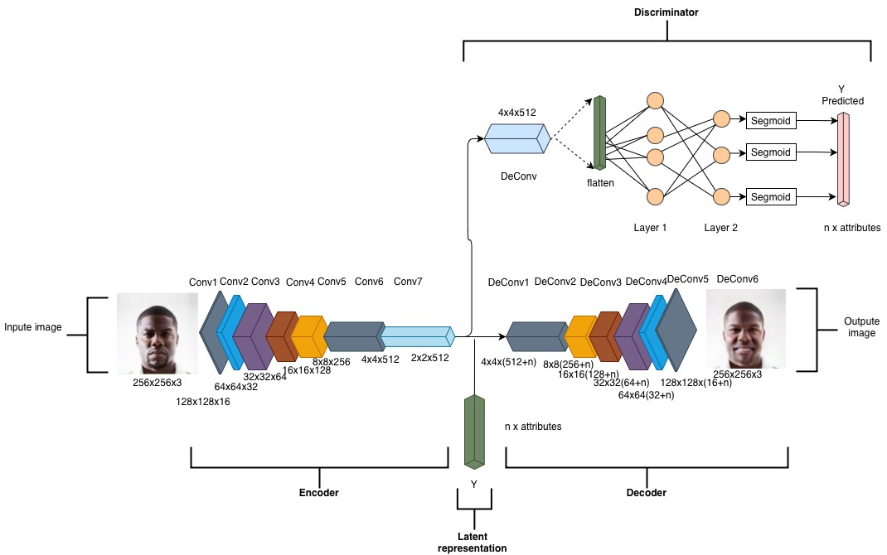

# Projet_MLA — Fader Networks  
Ce projet implémente un **pipeline complet de Fader Networks** 

 

  
## Contexte et objectif du projet

Les **Fader Networks** sont des modèles génératifs introduits pour permettre la **modification contrôlée d’attributs sémantiques** dans des images, tout en préservant le contenu principal, ici l’identité d’un visage. Contrairement à des approches classiques de génération conditionnelle, les Fader Networks cherchent à apprendre une **représentation latente indépendante des attributs** à modifier.

Dans ce projet, nous implémentons et étudions les Fader Networks appliqués au dataset **CelebA**, afin de manipuler des attributs binaires tels que :
- *Male / Female*  
- *Smiling*  
- *Eyeglasses*  
- *Young*  

L’objectif principal est de :
- comprendre le **fonctionnement interne des Fader Networks**,
- implémenter l’architecture complète (encodeur, décodeur, discriminateur),
- entraîner des modèles pour différents attributs,
- analyser qualitativement les résultats via des **interpolations progressives**.

---

## Architecture des Fader Networks

L’architecture repose sur trois composants principaux :

1. **Encodeur (Encoder)**  
   Il projette l’image d’entrée dans un espace latent compact censé être **invariant vis-à-vis des attributs**.

2. **Décodeur (Decoder)**  
   Il reconstruit l’image à partir du code latent et d’un vecteur d’attributs explicite, permettant de **forcer la présence ou l’absence d’un attribut**.

3. **Discriminateur (Discriminator)**  
   Il agit dans l’espace latent et tente de prédire les attributs à partir de la représentation latente.  
   L’encodeur est entraîné de manière adversariale pour empêcher cette prédiction.  
---

## Schéma global de l’architecture

Le schéma ci-dessous illustre l’architecture complète utilisée dans ce projet :



**Principe général :**
- l’image est encodée en un vecteur latent,
- le vecteur latent est concaténé avec un vecteur d’attributs,
- le décodeur génère une image modifiée,
- le discriminateur impose l’invariance du latent vis-à-vis des attributs.

Ce mécanisme permet de générer des **interpolations continues** entre différentes valeurs d’un attribut tout en conservant l’identité du visage.

---


Le dépôt couvre :
- le **prétraitement** du dataset **CelebA**,
- l’**implémentation de l’architecture** des Fader Networks,
- l’**entraînement** des modèles pour différents attributs sur CelebA,
- la **génération d’interpolations** et l’analyse qualitative des résultats.

Le projet inclut également un dossier **`traitement_data_oxford`**, correspondant à un travail
préliminaire de préparation du dataset **Oxford 102 Flowers**.  
Faute de temps, l’entraînement des Fader Networks sur cette base n’a pas été mené à terme.
La suite du projet, ainsi que l’ensemble des résultats présentés, portent donc exclusivement
sur le dataset **CelebA**.


Toutes les commandes doivent être exécutées depuis la racine du projet :
```bash
Projet_MLA/
```

---

## 1. Dépendances et installation

### 1.1 Python
- Version recommandée : **Python 3.12**

### 1.2 Installation des dépendances

Les dépendances du projet sont listées dans le fichier `requirements.txt`.

Pour les installer, exécuter depuis la racine du projet :

```bash
pip install -r requirements.txt
```
---

## 2. Dataset CelebA

Le dataset **CelebA n’est pas inclus dans le dépôt GitHub** en raison de sa taille.

Lien officiel :
https://mmlab.ie.cuhk.edu.hk/projects/CelebA.html

Fichiers requis :
- img_align_celeba.zip
- list_attr_celeba.txt
- list_eval_partition

Organisation attendue :
```text
Projet_MLA/
└── CelebA/
    └── CelebA/
        └── images/
        └── Ano 
        └── Eval  
```

---

## 3. Prétraitement des données

Avant tout entraînement ou test, les données CelebA doivent être prétraitées
afin d’être compatibles avec l’architecture des Fader Networks.

Le prétraitement réalise :
- le **recadrage et redimensionnement** des images en **256×256**,
- la **normalisation des pixels** dans l’intervalle **[-1, 1]**,
- la **conversion des attributs CelebA** en un format exploitable par PyTorch.

---

### 3.1 Scripts de prétraitement

Les scripts sont regroupés dans le dossier `preprocess/` :

- `pretraitement_des_images.py`  
  → chargement des images CelebA, recadrage, redimensionnement  

- `pretraitement_des_attributs.py`  
  → lecture du fichier `list_attr_celeba.txt` et conversion en un dictionnaire PyTorch

- `pretraitement_data.py`  
  → script principal qui exécute l’ensemble du pipeline de prétraitement

---

### 3.2 Lancer le prétraitement

La commande suivante doit être exécutée **depuis la racine du projet** :

```bash
python preprocess/pretraitement_data.py
```

---

## 4. Architecture du modèle (`codes_source/`)

Le dossier `codes_source/` contient l’implémentation complète de l’architecture
des **Fader Networks**, composée d’un encodeur, d’un décodeur et d’un discriminateur,
ainsi que les outils nécessaires à l’entraînement et au chargement des données.

---

### 4.1 Structure du dossier

```text
codes_source/
├── Encoder.py
├── Decoder.py
├── Discriminator.py
├── loader.py
└── entrainement/
```

---

## 5. Entraînement

L’entraînement consiste à apprendre un Fader Network pour **un attribut donné** (binaire),
par exemple `Male`, `Smiling`, `Eyeglasses` ou `Young`.

Le script `train_fader.py` entraîne conjointement :
- l’**encodeur** et le **décodeur** (reconstruction de l’image),
- le **discriminateur** (prédiction de l’attribut à partir du latent),
avec un objectif adversarial qui force le latent à devenir **indépendant de l’attribut**.

> Avant d’entraîner un modèle, il faut avoir exécuté le **prétraitement** (Section 3).

---

### 5.1 Lancer l’entraînement (commande)

Depuis la racine du projet :

```bash
python -m codes_source.entrainement.train_fader \
  --attr 'nom_attribut' \
  --root_dir . \
  --out_dir modeles_entraines \
  --epochs 500 \
  --epoch_size 50000 \
  --batch_size 32 \
  --ckpt_every 5000 \
  --save_every 2000 \
  --log_every 200

```
### Sorties générées 
```text
modeles_entraines/
└── <attribut>/
    ├── <attribut>.pth      # poids du modèle entraîné
    ├── checkpoints/        # sauvegardes intermédiaires    
    └── logs/               # logs d'entraînement (loss, infos)
```
 
---

## 6. Tests & Interpolations

 

Cette partie permet d’évaluer qualitativement les **modèles entraînés**
en générant des **interpolations d’attributs** sur des images du *split test* de CelebA.

Une interpolation consiste à **modifier progressivement la valeur d’un attribut**
(ex: Male) tout en conservant l’identité du visage, en faisant varier
le vecteur d’attributs fourni au décodeur.

---


### 6.1 Où sont les modèles entraînés ?

Les modèles entraînés sont sauvegardés dans le dossier :

```text
 
Dans `Modeles_entraines/<attribut>/<attribut>.pth` :
- `Modeles_entraines\male\male.pth`
- `Modeles_entraines\eyeglasses\eyeglasses.pth`
- `Modeles_entraines\smiling\smiling.pth`
- `Modeles_entraines\young\young.pth`
```


### 6.2  Scripts interpolations 

Les scripts du dossier `test_modeles_entraines/` permettent de **générer des interpolations d’attributs**
à partir des modèles entraînés, afin d’analyser qualitativement leur comportement.

- `test_trained_models_idx.py`  
  → génère des **interpolations** pour des images **choisies explicitement**
  à l’aide de leurs identifiants CelebA (`--img_ids`)

- `test_trained_models_random.py`  
  → génère des **interpolations** pour des images **sélectionnées aléatoirement**
  depuis le *split test* de CelebA (`--random_test`)

Dans les deux cas, le script :
- charge le modèle entraîné,
- encode l’image dans l’espace latent,
- fait varier progressivement le vecteur d’attributs,
- reconstruit une série d’images correspondant à une interpolation continue.


---

## 7) Commandes — permettent de **générer des interpolations d’attributs

> **Important :** vous pouvez choisir **autant d’images que vous voulez**   :  
> - `--img_ids id1 id2 ...` (idx)  
> - `--random_test K` (random)

### 8.1 Test sur IDs précis (idx)

#### Male (3 images)
```powershell
python .\test_modeles_entraines\test_trained_models_idx.py --model_pth .\Modeles_entraines\male\male.pth --attr_name Male --img_ids 202524 202576 202595 --alpha_min 2 --alpha_max 2 --n_interpolations 10
```

#### Eyeglasses (5 images)
```powershell
python .\test_modeles_entraines\test_trained_models_idx.py --model_pth .\Modeles_entraines\eyeglasses\eyeglasses.pth --attr_name Eyeglasses --img_ids 202577 202583 202595 202505 202567 --alpha_min 2 --alpha_max 2 --n_interpolations 10
```

#### Young (gain fort, exemple alpha=10)
```powershell
python .\test_modeles_entraines\test_trained_models_idx.py --model_pth .\Modeles_entraines\young\young.pth --attr_name Young --img_ids 202577 202583 202595 202505 202567 --alpha_min 10 --alpha_max 10 --n_interpolations 10
```

### 8.2 Test random (K images du split test)

#### Male (K=5) par exemple 
```powershell
python .\test_modeles_entraines\test_trained_models_random.py --model_pth .\Modeles_entraines\male\male.pth --attr_name Male --random_test 5 --seed 0 --alpha_min 2 --alpha_max 2 --n_interpolations 10
```

#### Smiling (K=8)
```powershell
python .\test_modeles_entraines\test_trained_models_random.py --model_pth .\Modeles_entraines\smiling\smiling.pth --attr_name Smiling --random_test 8 --seed 0 --alpha_min 2 --alpha_max 2 --n_interpolations 10
```

---

---

## 7. Résultats

Les résultats sont générés dans :
```text
results/
```

## Conclusion

Ce projet propose une implémentation complète et fonctionnelle des **Fader Networks**,
appliquée au dataset **CelebA**, depuis le prétraitement des données jusqu’à
l’analyse qualitative des résultats.

Il met en évidence la capacité de ces modèles à **désentrelacer le contenu visuel**
et les attributs sémantiques, permettant de modifier progressivement des caractéristiques
faciales tout en conservant l’identité du visage. Les expériences réalisées illustrent
à la fois le potentiel de cette approche et ses limites, notamment lorsque l’intensité
des interpolations devient trop élevée.

Faute de temps, l’entraînement sur d’autres jeux de données, comme **Oxford 102 Flowers**,
n’a pas été mené à terme. Le travail effectué sur ce dataset constitue néanmoins
une base pour des **extensions futures** du projet.

 


---

 
